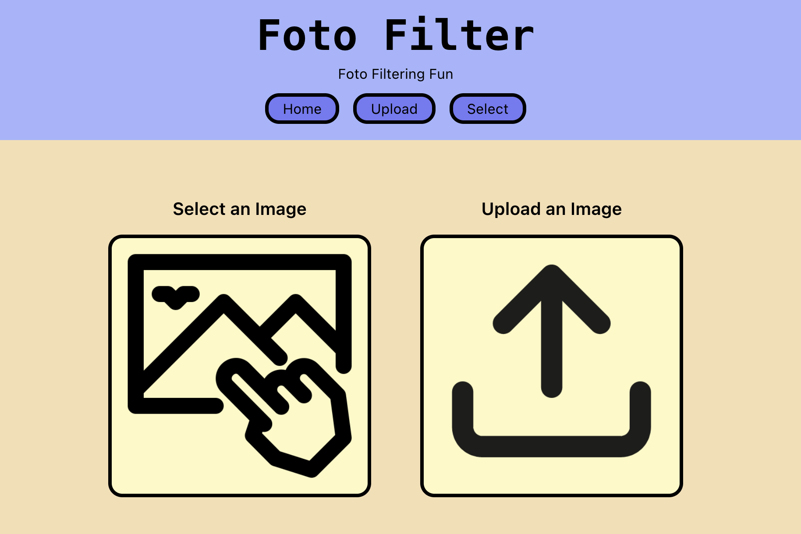

# FotoFilter

A brief description of what this project does and who it's for

FotoFilter is a Web Application created with React, and styled with Tailwind CSS. Users are able to select from a predetermined list of photos, or upload one of their one from their local computer. Once selected, the user can choose to apply several filters onto their photo. 

## Tech Stack/Libraries

**Client:** React, TailwindCSS\
**Libraries:** [React-Image-Filter](https://github.com/Stanko/react-image-filter)

## Features/Usage

- Predetermined images for User selection.
- Upload local image.
- Once selection/upload confirmed, user can filter using `sepia`, `grayscale`, `invert`, or `duotone` dial ranges to alter dark and light RGB tones.

## Running the Application
In the project directory, you can run:

`npm start`

Runs the app in development mode.\
Open [http://localhost:3000](http://localhost:3000) to view it in your browser.

The page will reload when you make changes.\
You may also see any lint errors in the console.
## Attribution

 - [No Photo Icon - Created by Icon.doit](https://www.flaticon.com/free-icons/no-photo)
 - [Photo and Camera Icons - Created by orvipixel](https://www.flaticon.com/free-icons/photo-and-camera)
 - [React-Image-Filter](https://github.com/Stanko/react-image-filter) [ - Created by Stanko](https://github.com/Stanko)

